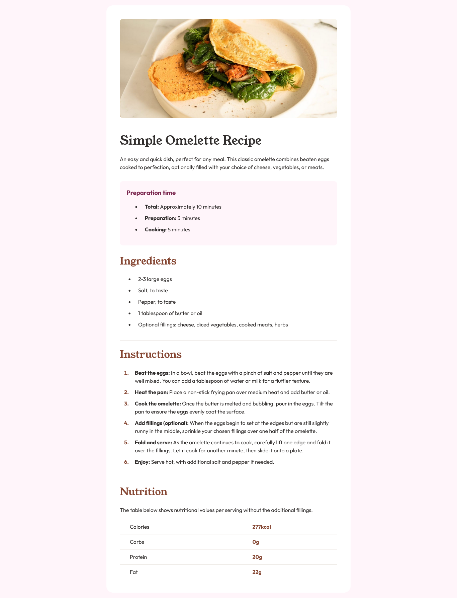
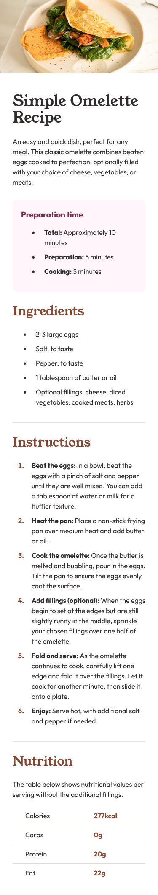

# Frontend Mentor - Recipe page solution

This is a solution to the [Recipe page challenge on Frontend Mentor](https://www.frontendmentor.io/challenges/recipe-page-KiTsR8QQKm). Frontend Mentor challenges help you improve your coding skills by building realistic projects. 

## Table of contents

- [Overview](#overview)
  - [The challenge](#the-challenge)
  - [Desktop Screenshot](#desktop-screenshot)
  - [Mobile Screenshot](#mobile-screenshot)
  - [Links](#links)
- [My process](#my-process)
  - [Built with](#built-with)
  - [What I learned](#what-i-learned)
  - [Continued development](#continued-development)
  - [Useful resources](#useful-resources)
- [Author](#author)

## Overview

### Desktop Screenshot



### Mobile Screenshot



### Links

- Solution URL: [Add solution URL here](https://your-solution-url.com)
- Live Site URL: [Add live site URL here](https://omelette-recipe-page-dorian.netlify.app/)

## My process

### Built with

- Semantic HTML5 markup
- CSS custom properties
- Flexbox
- Mobile-first workflow
- [React](https://reactjs.org/) - JS library

### What I learned

In order to add border style to a table row, you have to add the property border-collapse.

```css
table {
  border-collapse: collapse; 
}

tr {
  border-bottom: 1px solid var(--light-grey);
}
```

### Continued development

I wish to learn more on CSS Grid.

### Useful resources

- [How to create space between list bullets and text in HTML](https://www.geeksforgeeks.org/how-to-create-space-between-list-bullets-and-text-in-html/) - This helped me to increase the space between the bullets and the text in the ordered and unordered lists.
- [Add border-bottom to table-row <tr>](https://stackoverflow.com/questions/10040842/add-border-bottom-to-table-row-tr) - This link helped me add a border-bottom line to table rows.
- [How to add column padding to the first column of a specific table in javascript?](https://stackoverflow.com/questions/32980234/how-to-add-column-padding-to-the-first-column-of-a-specific-table-in-javascript) - This helped me add padding to the first column of my table in the nutrition block.

## Author

- LinkedIn - [DORIAN TAPONZING DONFACK](https://linkedin.com/in/dorian-taponzing-donfack-0269892a9)
- Frontend Mentor - [@thebreezyguy1](https://www.frontendmentor.io/profile/thebreezyguy1)
- Twitter - [@thebreezyguy168](https://www.twitter.com/thebreezyguy168)
